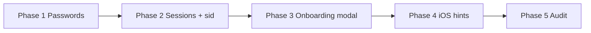

# Security & Account Roadmap (RU)

План доработок: сброс/смена пароля, восстановление доступа, активные сессии, онбординг, iOS-подсказки для push и **admin support**.

**Статус (2026-06-06): Phase 1–5 реализованы.** Ниже — как это работает сейчас и что осталось опционально (тесты, open questions).

Связанные документы: [`PRODUCT_ROADMAP.md`](./PRODUCT_ROADMAP.md), уведомления (`NOTIFY_*` в `config/env.ts`).

---

## Сводка по фазам

| Фаза | Статус | Кратко |
|------|--------|--------|
| **1** Пароли и восстановление | ✅ | change / forgot / admin recovery, матрица strict/flexible, политика паролей |
| **2** Активные сессии | ✅ | список refresh-сессий, revoke; access JWT привязан к сессии (`sid`) |
| **3** Онбординг | ✅ | модалка после логина (1× на устройство) + карточка в профиле |
| **4** iOS PWA hints | ✅ | `IosPwaHint` в push-блоке и в шаге push онбординга |
| **5** Observability | ✅ | `SecurityAuditLog`, `NOTIFY_PASSWORD_*`, `/admin/security-audit` |

---

## Текущий baseline (актуально)

| Область | Состояние |
|--------|-----------|
| **Auth** | JWT access + refresh в HttpOnly cookies; `RefreshToken` с metadata сессии |
| **Access ↔ сессия** | В access JWT поле `sid` = `_id` документа `RefreshToken`; `authMiddleware` и `validateAccessToken` проверяют, что сессия ещё жива |
| **Logout** | `logout()` / `logoutAll()`; UI revoke в `UserSessionsPanel` |
| **MFA** | TOTP: setup / confirm / disable (self) / login step; admin reset |
| **Регистрация** | `REGISTRATION_MODE=email` — OTP на почту |
| **Пароли** | Смена в профиле, forgot flow, admin set password; политика в `config/password-policy.ts` |
| **Восстановление** | `account-recovery.service.ts`, `GET /api/v1/auth/recovery/capabilities`, strict/flexible |
| **Email** | Elastic-шаблоны password **опциональны** — пустое имя → plain text из i18n |
| **Уведомления** | login, MFA, password events — `NOTIFY_*` |
| **Push** | subscribe; публичный DTO без endpoint; iOS PWA hint |
| **Admin user** | роль/статус, sessions, recovery (MFA reset + password), security audit tab |
| **Онбординг** | `UserOnboarding`, модалка + карточка профиля, версионирование |

---

## Feature flags — `config/env.ts`

Отдельный `config/account-features.ts` **не используем**. Блок `ACCOUNT_CONFIG` в [`config/env.ts`](../config/env.ts):

```ts
const ACCOUNT_CONFIG = {
  passwordChangeEnabled,
  passwordForgotEnabled,
  recoveryStrictness,           // strict | flexible
  adminAccountRecoveryEnabled,
  sessionsEnabled,
  onboardingEnabled,
  onboardingPushPromptEnabled,
  publicOnboardingEnabled,      // NEXT_PUBLIC_ONBOARDING_ENABLED
  publicOnboardingPushPromptEnabled,
  publicPushIosPwaHintEnabled,  // NEXT_PUBLIC_PUSH_IOS_PWA_HINT_ENABLED
  onboardingVersion,            // ONBOARDING_VERSION — bump → онбординг снова
}
```

Клиентские флаги — `NEXT_PUBLIC_*`. Сервер проверяет флаг до логики route (404 или `{ enabled: false }`).

**Password recovery email** (`lib/services/account-recovery.service.ts`):

| `EMAIL_SEND_MODE` | Password recovery |
|-------------------|-------------------|
| `elastic` + API key | ✓ |
| `console` | ✓ dev — код в логах |
| `empty` | ✗ → MFA или support |

---

## Матрица восстановления

`AUTH_RECOVERY_STRICTNESS`: `strict` (оба фактора, если оба доступны) / `flexible` (один достаточен).

Реализовано в `account-recovery.service.ts` + UI forgot / profile change. Экран support — i18n `auth.recovery.contactSupport`.

`GET /api/v1/auth/recovery/capabilities` — платформа, strictness, факторы для текущего user (с auth).

---

## Phase 1 — Пароли и восстановление ✅

### 1.1 Смена пароля в профиле

**UI:** `ProfileChangePasswordPanel` на `/profile` (сворачиваемый блок), если `AUTH_PASSWORD_CHANGE_ENABLED=1`.

**API:** `POST /api/v1/auth/password/change` — request + confirm в одном flow с `pendingId`.

**После успеха:** `logoutAll()`, security audit, `NOTIFY_PASSWORD_*` (если включено).

**Политика паролей:** `config/password-policy.ts` + `lib/validation/password-policy.ts` — единые правила на UI (`PasswordField`, `PasswordStrengthPanel`) и бэкенде. Логин **без** политики.

### 1.2 Забыл пароль

**UI:** `/forgot-password` (ссылка с `/login`).

**API:**

| Method | Path |
|--------|------|
| `POST` | `/api/v1/auth/password/forgot` |
| `POST` | `/api/v1/auth/password/forgot/verify-email` |
| `POST` | `/api/v1/auth/password/forgot/verify-totp` |
| `POST` | `/api/v1/auth/password/forgot/complete` |

Email-фактор: 6-digit OTP (как sign-up). Шаблоны Elastic опциональны.

### 1.3 Admin support

**Env:** `AUTH_ADMIN_ACCOUNT_RECOVERY_ENABLED=1`, только `ADMIN`.

| Действие | API |
|----------|-----|
| Сброс MFA | `POST /api/v1/user/[id]/mfa/reset` |
| Установить пароль | `POST /api/v1/user/[id]/password/reset` |

**UI:** `AdminUserRecoveryPanel` в admin user profile. Audit + notify.

`mustChangePassword` — **не реализован** (v1: admin задаёт обычный пароль, user меняет сам).

### 1.4 Чеклист Phase 1

- [x] `ACCOUNT_CONFIG` + `.env.example`
- [x] `account-recovery.service.ts`, password change/forgot services
- [x] i18n `auth.password.*`, `auth.recovery.*`, `admin.userRecovery.*`, `password.policy.*`
- [x] Email: optional Elastic templates + i18n fallback
- [x] Централизованная политика паролей
- [ ] Автотесты по ячейкам матрицы
- [ ] `mustChangePassword` (опционально, v2)

---

## Phase 2 — Активные сессии ✅

### Как устроено

Одна строка = один активный **`RefreshToken`** (отдельной модели `UserSession` нет — metadata на самом refresh).

| Событие | Поведение |
|---------|-----------|
| Login / register / MFA login | `RefreshToken.create` + `deviceLabel`, `userAgent`, `ip`, `lastSeenAt` |
| Refresh rotation | **та же** запись (`updateOne` по `_id`): новый token hash, `lastSeenAt` |
| Revoke / logoutAll | `deleteOne` / `deleteMany` |

### Привязка access token к сессии (важно)

При выдаче токенов в access и refresh JWT кладётся **`sid`** = `RefreshToken._id`.

На каждом authenticated запросе `assertActiveAccessSession(payload)` проверяет, что документ с этим `_id` существует и не истёк.

**Следствие:** revoke сессии **сразу** рвёт доступ (не ждём expiry access JWT ~1 ч). Старые токены без `sid` валидны только по подписи до истечения.

### Текущая сессия

`findCurrentSessionId(refreshCookie)` **или** fallback `authResult.payload.sid` из access cookie.

«Выйти на всех других» без определённой текущей сессии **ничего не удаляет** (защита от случайного logout all).

### API

| Method | Path | Auth |
|--------|------|------|
| `GET` | `/api/v1/auth/sessions` | user |
| `DELETE` | `/api/v1/auth/sessions/[id]` | user (не current) |
| `DELETE` | `/api/v1/auth/sessions?exceptCurrent=1` | user |
| `GET` | `/api/v1/user/sessions/[userId]` | admin (+ IP, UA) |
| `DELETE` | `/api/v1/user/sessions/[userId]/[sessionId]` | admin |
| `DELETE` | `/api/v1/user/sessions/[userId]` | admin — logout all |

**UI:** `UserSessionsPanel` (profile), `AdminUserSessionsPanel` (admin user).

**Env:** `AUTH_SESSIONS_ENABLED=1` — user + admin.

### Чеклист Phase 2

- [x] `user-session.service.ts`
- [x] Hooks в `generateAuthResponse` + `rotateRefreshToken`
- [x] `sid` в JWT + проверка в middleware
- [x] UI + i18n `user.sessions.*`
- [ ] Автотесты list / revoke / isCurrent

---

## Phase 3 — Онбординг ✅

### Флаги

| Env | Назначение |
|-----|------------|
| `ONBOARDING_ENABLED` | серверный API |
| `NEXT_PUBLIC_ONBOARDING_ENABLED` | UI (модалка + карточка) |
| `ONBOARDING_PUSH_PROMPT_ENABLED` | шаг push в списке шагов |
| `NEXT_PUBLIC_ONBOARDING_PUSH_PROMPT_ENABLED` | то же на клиенте |
| `ONBOARDING_VERSION` | bump → онбординг снова для user + новый ключ localStorage |

### Шаги

`profile` → `mfa` → `push` (push опционален по флагам).

Авто-завершение по фактическому состоянию: профиль всегда ✓ при визите, MFA если `mfaEnabled`, push если есть подписка.

Модель: `UserOnboarding` (`completedSteps`, `dismissedAt`, `version`).

### Два UI-слоя

**1. Модалка после входа** (`OnboardingModalHost` → `OnboardingModal`)

- Показывается после успешного auth на любой странице (кроме login/logout/refresh).
- Условия: onboarding enabled, не `dismissed` на сервере для **текущей версии**, не `complete`, нет флага в localStorage.
- **Один раз на устройство/браузер:** `localStorage` ключ `onboarding-modal-seen:v{version}`.
- Пошаговый wizard; на шаге push — `IosPwaHint` + кнопка subscribe.
- Закрытие / «Пропустить» / «Понятно» → флаг в localStorage.
- Редирект на `/profile?onboarding=1` после регистрации **убран** — модалка сама всплывает.

**2. Карточка в профиле** (`OnboardingCard`)

- Всегда видна, пока user не нажмёт **«Больше не показывать»** (`dismissedAt` на сервере).
- Не скрывается автоматически при `complete` — только явный dismiss.
- Кнопки «Настроить ниже» скроллят к `#profile-mfa` / `#profile-notifications` (не «Открыть профиль»).
- Dismiss → сервер + `markOnboardingModalSeen(version)` в localStorage.

### Версии

- Серверный dismiss действует только если `doc.version === ONBOARDING_VERSION`.
- При bump версии: карточка и модалка снова доступны; новый ключ localStorage.

**API:** `GET/PATCH /api/v1/user/onboarding` (`complete` step / `dismiss`).

### Чеклист Phase 3

- [x] `onboarding.service.ts`, `UserOnboarding`
- [x] `OnboardingModal`, `OnboardingModalHost`, `modal-storage.ts`
- [x] `OnboardingCard` в profile
- [x] i18n `onboarding.*` (включая `onboarding.modal.*`)
- [ ] Автотесты dismiss / version bump

---

## Phase 4 — iOS PWA hints ✅

**Env:** `NEXT_PUBLIC_PUSH_IOS_PWA_HINT_ENABLED=1`.

**Компонент:** `IosPwaHint` — показ на iOS Safari вне standalone/PWA.

**Где:** `NotificationBlock` на `/profile` и шаг push в `OnboardingModal`.

---

## Phase 5 — Observability ✅

- [x] `SecurityAuditLog` — `password_changed`, `password_reset`, `admin_password_set`, `admin_mfa_reset`, …
- [x] `NOTIFY_PASSWORD_*`
- [x] `/admin/security-audit` + вкладка в admin user profile

---

## Порядок реализации (выполнен)



---

## Чеклист env (`.env.example`)

```bash
# --- Account & security (0=off, 1=on unless noted) ---

AUTH_PASSWORD_CHANGE_ENABLED=0
AUTH_PASSWORD_FORGOT_ENABLED=0
AUTH_RECOVERY_STRICTNESS=strict
AUTH_ADMIN_ACCOUNT_RECOVERY_ENABLED=0
AUTH_SESSIONS_ENABLED=0

ONBOARDING_VERSION=1
ONBOARDING_ENABLED=0
ONBOARDING_PUSH_PROMPT_ENABLED=0
NEXT_PUBLIC_ONBOARDING_ENABLED=0
NEXT_PUBLIC_ONBOARDING_PUSH_PROMPT_ENABLED=0

NEXT_PUBLIC_PUSH_IOS_PWA_HINT_ENABLED=0

NOTIFY_PASSWORD_ENABLED=0
NOTIFY_PASSWORD_CHANNELS=email
```

**Связанные переменные:**

```bash
EMAIL_SEND_MODE=console   # dev: recovery OK (код в логах)
EMAIL_SEND_MODE=empty     # recovery email OFF
EMAIL_API_KEY=            # elastic
EMAIL_TEMPLATE_PASSWORD_CHANGE_EN=   # optional
EMAIL_TEMPLATE_PASSWORD_FORGOT_EN=   # optional
MFA_ENCRYPTION_KEY=
JWT_ACCESS_EXPIRES_IN=3600
JWT_REFRESH_EXPIRES_IN=15724800
```

---

## Файлы (реализованные)

```
config/env.ts
config/password-policy.ts
lib/validation/password-policy.ts
lib/services/account-recovery.service.ts
lib/services/password/password-change.service.ts
lib/services/password/password-forgot.service.ts
lib/services/admin-account-recovery.service.ts
lib/services/user-session.service.ts
lib/services/onboarding.service.ts
lib/services/auth.service.ts              # sid в JWT, session hooks
lib/db/models/UserOnboarding.ts
lib/db/models/SecurityAuditLog.ts
lib/security/auth.ts                      # assertActiveAccessSession

src/app/api/v1/auth/recovery/capabilities/route.ts
src/app/api/v1/auth/password/**
src/app/api/v1/auth/sessions/**
src/app/api/v1/user/sessions/**
src/app/api/v1/user/onboarding/route.ts
src/app/api/v1/user/[id]/mfa/reset/route.ts
src/app/api/v1/user/[id]/password/reset/route.ts
src/app/api/v1/admin/security-audit/route.ts

src/app/forgot-password/page.tsx
src/app/profile/page.tsx
src/app/admin/security-audit/page.tsx

src/components/Views/Profile/ProfileChangePasswordPanel.tsx
src/components/Views/User/Blocks/UserSessionsPanel.tsx
src/components/Views/User/Blocks/AdminUserSessionsPanel.tsx
src/components/Views/User/Blocks/AdminUserRecoveryPanel.tsx
src/components/Views/Onboarding/OnboardingCard.tsx
src/components/Views/Onboarding/OnboardingModal.tsx
src/components/Views/Onboarding/OnboardingModalHost.tsx
src/components/Views/Push/IosPwaHint.tsx
src/components/Fields/Password/**

src/lib/onboarding/modal-storage.ts
src/providers/DeferredClientChrome.tsx      # OnboardingModalHost
```

---

## Open questions (остались)

1. **Forgot email factor:** сейчас только OTP; magic link — опционально v2.
2. **Flexible mode:** ограничения «lost email» только при MFA N дней — не делали.
3. **Admin set password:** `mustChangePassword` — не делали (v2).
4. **`AUTH_SUPPORT_HINT` env:** не нужен, текст в i18n.
5. **Автотесты** security/account flows — backlog.

---

*Обновлено: 2026-06-06 — Phase 1–5 done; sessions `sid`; onboarding modal + localStorage; актуальный baseline.*
